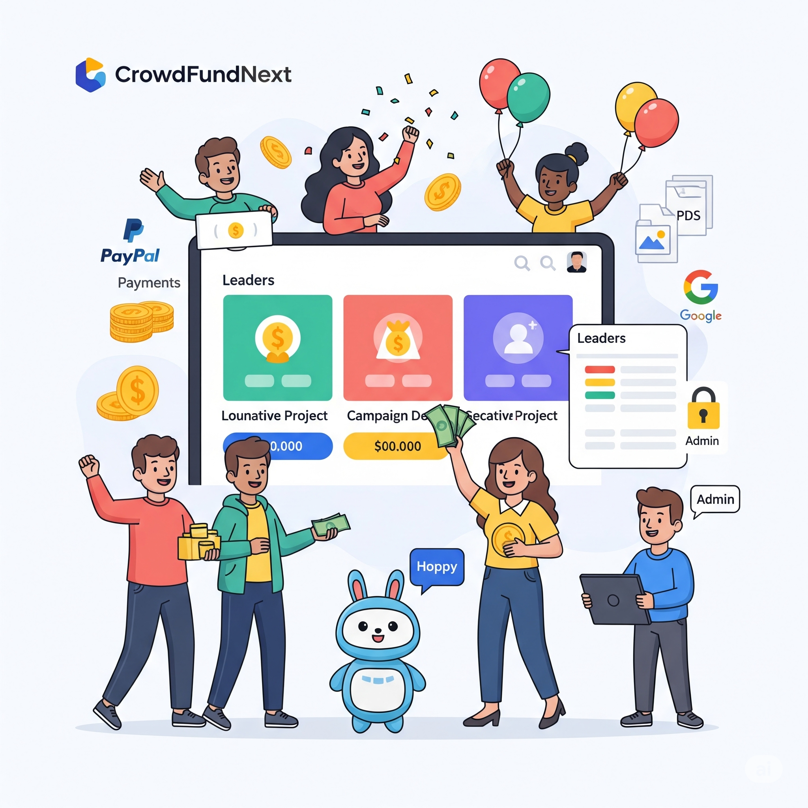

# 🌐 CrowdFundNext

**CrowdFundNext** is a full-stack, production-grade crowdfunding platform built with the **MERN stack** (MongoDB, Express, React, Node.js), featuring modern authentication, real payments, AI-powered campaign creation, robust admin/user management, and advanced file handling.

---


*CrowdFundNext: Modern crowdfunding with AI, PayPal, file uploads, admin controls, and more!*


## 🏗️ Architecture Overview


- **Frontend:** React (Vite), Material UI, Firebase JS SDK, PayPal SDK
- **Backend:** Node.js, Express, Firebase Admin SDK, Google GenAI, Multer
- **Database:** MongoDB Atlas
- **Payments:** PayPal REST API
- **AI:** Google GenAI (Gemini) for campaign content and chatbot
- **File Storage:** Local server (uploads/), auto-cleanup

---

## ✨ Key Features (Deep Dive)

### 🔐 Authentication & Security
- **Firebase Authentication** for Google OAuth and email/password
- **JWT-based session management** for secure API access
- **Google OAuth**: One-click sign up/login, seamless integration
- **Role-based access**: User/admin separation
- **Fraud prevention**: Cannot delete account with active campaigns; all transactions tracked
- **Environment variables**: All secrets/configs in `.env` files

### 🤖 AI Integration
- **AI Generate Modal**: Instantly generate campaign titles/descriptions using Google GenAI (Gemini)
- **Hoppy Chatbot**: In-app AI assistant for onboarding and support, powered by backend AI service
- **Backend AI Service**: Node.js service connects to Google GenAI API

### 💸 Payments & Withdrawals
- **PayPal Integration**: Real, secure donations via PayPal SDK (no overfunding allowed)
- **Withdrawal System**: Campaign creators can withdraw funds (partial/full), with bank details and anti-fraud logic
- **Transaction Model**: All donations and withdrawals stored as transactions in MongoDB
- **Withdrawal History**: UI shows withdrawal stats and history per campaign

### 🗂️ File Management
- **Uploads**: Profile pictures, campaign photos, support documents (PDF)
- **Multer-based upload services**: Separate for campaigns and users
- **Automatic Cleanup**: Files deleted on campaign/user deletion (backend logic)
- **Static Serving**: `/uploads` route for serving images/docs

### 🛠️ Admin Controls
- **Admin Dashboard**: Manage users, campaigns, and transactions
- **Campaign Moderation**: Approve/reject, filter by status, country, state, type
- **Platform Stats**: View total funds, campaigns, and leaderboards
- **Advanced Filtering**: By country, state, type, and search

### 📊 User Experience
- **Modern UI/UX**: Material UI, responsive design, glassmorphic effects
- **Conditional Actions**: Donate button hidden for own campaigns; edit/delete only for eligible campaigns
- **Leaderboard**: Top donors and campaigns
- **Profile Management**: Edit info, upload/change profile picture
- **Instant Help**: Hoppy chatbot always available

---

## 🗺️ Main Pages & Components

### Pages
- **HomePage**: Landing, explore, about, contact
- **RegisterPage/LoginPage**: Auth (Google/email), profile image upload
- **UserHome**: User dashboard, campaign stats
- **UserCampaigns**: List/manage own campaigns, withdrawal history
- **UserPostCampaign**: Create campaign (AI modal, file upload)
- **UserSettings**: Profile, password, delete account
- **AdminDashboard**: Platform stats, leaderboards
- **AdminManageCampaigns/Users/Transactions**: Full admin controls

### Components
- **CampainCard**: Campaign display, donate, edit, withdraw
- **AIGenerateModal**: AI-powered content creation
- **DonationAmountModal/PayPalDonateModal**: PayPal donation flow
- **EditCampaignModal**: Edit campaign details/files
- **ChatBotFloatingButton/UI**: Hoppy chatbot
- **ProfileForm**: Edit profile, upload/change picture
- **Leaderboard**: Top donors/campaigns
- **NavBar/Footer**: Contextual navigation for home/user/admin

---

## 🔌 API Overview (Key Endpoints)

- `POST /api/auth/register` — Register user (with profile picture upload)
- `POST /api/auth/login` — Login (JWT)
- `GET /api/campaigns` — List/search campaigns (with filters)
- `POST /api/campaigns` — Create campaign (with file upload)
- `PATCH /api/campaigns/:id` — Edit campaign (with file upload)
- `DELETE /api/campaigns/:id` — Delete campaign (auto file cleanup)
- `POST /api/campaigns/:id/donate` — Donate (PayPal)
- `POST /api/campaigns/:id/withdraw` — Withdraw funds (creator only)
- `GET /api/campaigns/my-withdrawals` — List own campaigns with withdrawal info
- `GET /api/ai/generate` — AI content generation (title/description)
- `GET /api/ai/chat` — Hoppy chatbot
- `GET /api/admin/stats` — Platform stats (admin)

---

## 🛡️ Security & Best Practices
- **All secrets in `.env`** (never committed)
- **JWT required for all protected endpoints**
- **File uploads validated and sanitized**
- **Fraud checks**: No overfunding, withdrawal limits, active campaign lock
- **Automatic file cleanup**: No orphaned files

---

## 🧪 Dev & Deployment

### Prerequisites
- Node.js, npm, Docker (optional)
- Firebase project (for Auth)
- PayPal developer account (for sandbox keys)

### Setup
- Copy `env.txt` to `.env` and fill in your secrets (Firebase, PayPal, MongoDB, etc.)
- Place Firebase Admin SDK key in `server/config/`
- Add Firebase web config to `client/src/utils/firebase.js`

### Start the Project
```bash
docker-compose up --build
# or run client and server separately
```

### Troubleshooting
- **Firebase errors**: Check API keys and web config
- **PayPal issues**: Use sandbox keys for dev, check client/server env
- **MongoDB**: Ensure Atlas IP whitelist includes your dev machine

---

## 📁 Folder Structure
```
CrowdFundNext/
├── client/         → React frontend (Vite + Firebase)
├── server/         → Node.js + Express + MongoDB + Firebase Admin
├── env.txt         → Environment variable reference
└── README.md       → You're here!
```

---

## 🧱 Libraries & Tools
- React, React Router DOM
- Material UI
- Firebase JS SDK & Admin SDK
- Mongoose
- Vite (w/ SWC)
- Docker
- PayPal REST SDK
- Google GenAI (Gemini)
- Multer (file uploads)

---

## 🚀 Unique Aspects
- **AI-powered campaign creation and chatbot**
- **Real PayPal payments (no overfunding)**
- **Withdrawal system with anti-fraud logic**
- **Automatic file cleanup on deletion**
- **Admin dashboard with advanced filtering**
- **Modern, responsive UI/UX**

---

## 🧱 Future Features
- Email notifications
- Analytics dashboard for admin
- More payment gateways (Stripe, Razorpay)
- Campaign trending algorithm
- Real-time chat/support

---

## 🤝 Contributing
1. Fork the repo
2. Clone your fork
3. Create a new branch: `git checkout -b feature-name`
4. Make changes and commit: `git commit -m "Added new feature"`
5. Push to branch: `git push origin feature-name`
6. Open a pull request

---

## 🧑‍💻 Author
**Ali Ahammad (Li)**  
[Portfolio](https://www.aliahammad.com/) | [LinkedIn](https://www.linkedin.com/in/ali-ahammad-li0812/) | [GitHub](https://github.com/li812)

---

## 📝 License
This project is for educational and academic use under the **MIT License**. See `LICENSE` for more info.

---

## 💬 Feedback?
Feel free to open an issue or share feedback through the platform once deployed!
